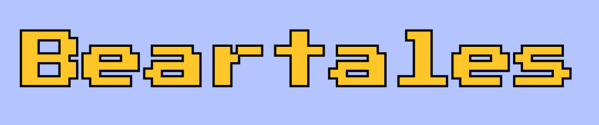

# 🐻 **Beartales**

>A seguir está o passo a passo para conseguir jogar **Beartales**, um projeto desenvolvido na disciplina de **Computação Gráfica**, utilizando **Python** e **Pygame**.  
>Neste jogo, você ajudará dois irmãos ursos — **Marsha** e **Levy Jr.** — a limpar sua toca de misteriosas **poças d’água encantadas**.  
>O projeto foi totalmente desenvolvido com base no clássico *Sokoban*, incluindo fases, movimentação e detecção de colisões.



Uma

---

## **Era uma vez...**

Nas profundezas da **Floresta dos Murmúrios**, a toca dos irmãos **Marsha** e **Levy Jr.** foi inundada após uma chuva mágica.  
Agora, o chão está repleto de **poças d’água encantadas** que borbulham com uma energia misteriosa, bagunçando a harmonia da floresta.

Mas há esperança!  
A lenda diz que a única maneira de selar seu poder é cobrindo-as com as **caixas de madeira sagrada** deixadas por seus ancestrais.  
Quando uma caixa cobre uma poça, algo incrível acontece:  
✨ **a madeira se transforma em ouro puro!**

Sua missão é **ajudar os irmãos a empurrar cada caixa até a poça correspondente**, restaurando a paz na toca e enchendo o lar dos ursinhos de tesouros dourados.

---

## ✨ **Funcionalidades**

* **Seleção de Personagem:** Escolha jogar com a **Marsha** ou com o **Levy Jr.** no menu inicial!
* **16 Níveis Desafiadores:** Quebra-cabeças que testarão sua lógica e planejamento estratégico.
* **Controles Simples e Intuitivos:** Fácil de aprender, difícil de dominar.

---

## 🎮 **Como Jogar**

| Ação | Tecla |
| :--- | :--- |
| Mover para cima | ⬆️ ou **W** |
| Mover para baixo | ⬇️ ou **S** |
| Mover para a esquerda | ⬅️ ou **A** |
| Mover para a direita | ➡️ ou **D** |
| Reiniciar o nível | **R** |
| Sair do jogo | **ESC** |

>💡 **Objetivo:** Empurre todas as caixas de madeira sagrada sobre as poças d’água encantadas.
>Quando todas forem cobertas, o nível será concluído automaticamente.

---

## 🧩 **Como Executar o Jogo**

### 1️⃣ Pré-requisitos

Certifique-se de ter o **Python 3** instalado em sua máquina.
Para verificar, abra o terminal e digite:

```sh
       python --version
```

### 2️⃣ Instale a Biblioteca Pygame

Com o Python instalado, você precisará da biblioteca **Pygame**. Instale-a com o seguinte comando no seu terminal:

```sh
       pip install pygame
```

### 3️⃣ Baixe os Arquivos do Jogo

Clone este repositório para a sua máquina local ou baixe os arquivos como um arquivo ZIP.
`git clone https://github.com/Grizzlyess/Beartales.git`

### 4️⃣ Estrutura de Pastas

Garanta que a estrutura de arquivos esteja correta, com o script principal e a pasta `assets` no mesmo diretório:

    Beartales/
    ├── assets/
    │   ├── agente1.png
    │   ├── som.mp3
    │   └── ... (etc)
    ├── Sokoban.py
    └── README.md

### 5️⃣ Execute o Jogo!

Navegue até a pasta do projeto  e execute:

```sh
       python Sokoban.py
```
   
>🎉 **Pronto!** Agora é só se divertir e ajudar os ursinhos a transformar tudo em ouro.

### Ume versão online está disponível em: [Acesse o jogo aqui!](https://grizzlyess.github.io/beartales-jogo/)
